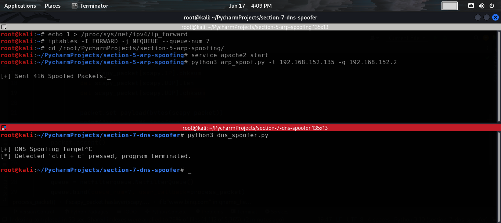

# DNS Spoofer
This Python script allows you to perform DNS spoofing by intercepting DNS packets and modifying their responses. It utilizes the netfilterqueue library to capture and manipulate network traffic.

## Prerequisites
Before running the script, make sure you have the following prerequisites installed:
- Python 3.xx
- `scapy` library
- `netfilterqueue` library
You can install the required libraries using pip:
```commandline
$ pip install scapy netfilterqueue
```

## Usage
```commandline
$ python3 dns_spoofer.py --host <IP_ADDRESS> --queue-num <QUEUE_NUMBER> --domain <DOMAIN_NAME>
```

## Options
- `--host`: Specify the IP address for your fake DNS server.
- `--queue-num`: Specify the queue number to trap the sniffed packets.
- `--domain`: Specify the domain name that you want to spoof its IP.

## Example usage:
- first you need to edit the `iptables` rules to redirect the sniffed packets to you own kali machine:
```commandline
$ iptables -I FORWARD -j NFQUEUE --queue-num 7
```
- then you can run your script and provide the `queue-num` to the one that you specified before in the command above:
```commandline
$ python3 dns_spoofer.py --host 192.168.152.134 --queue-num 7 --domain www.bing.com
```

## Screenshot


## Important Note
To run this script, you need root privileges since it involves manipulating network traffic. Make sure to run it with administrative rights.

## Acknowledgments
This script is provided for educational purposes only. Use it responsibly and at your own risk.

**Disclaimer:** This script should only be used on networks that you have permission to test or for educational purposes on your own network. Unauthorized use is illegal and unethical.
